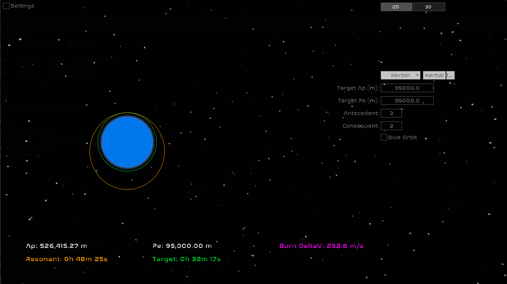
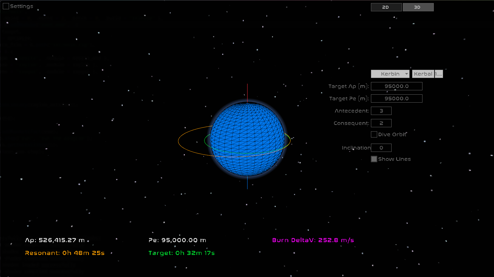

# OrbitalTools

A resonant orbit planner for **Kerbal Space Program** and **real solar system** bodies, built with [Zig](https://ziglang.org/) and [raylib](https://www.raylib.com/).





> NEW 3D Mode!
---

## What it does

OrbitalTools calculates and visualizes **resonant orbits** — the transfer orbits used to deploy satellite constellations into evenly-spaced slots. Given a target circular orbit and a resonance ratio (e.g. 3:2), it computes the resonant orbit's apoapsis, periapsis, period, and the delta-v required for the transfer burn.

It supports two modes:

- **Raise orbit** — periapsis is held fixed, apoapsis extends outward (slower pass, satellite drifts forward)
- **Dive orbit** — apoapsis is held fixed, periapsis drops inward (faster pass, satellite drifts backward)

Orbits are rendered visually with atmosphere, SOI boundary, and color-coded validity (green = valid, red = intersects atmosphere or exceeds SOI).

---

## Features

- Resonant orbit calculation with configurable antecedent/consequent ratio
- Delta-v readout for the transfer burn
- Visual orbit display with atmospheric glow shader
- Sphere of influence boundary (dashed ring)
- Support for all KSP bodies (Kerbol system) and real solar system bodies (Sol system)
- Scrollable zoom on the orbit view
- Configurable resolution, font size, and font spacing
- 2D and 3D planner modes

---

## Bodies supported

**Kerbal Space Program** — Kerbol, Moho, Eve, Gilly, Kerbin, Mun, Minmus, Duna, Ike, Dres, Jool, Laythe, Vall, Tylo, Bop, Pol, Eeloo

**Real** — Sol, Mercury, Venus, Earth, Luna, Mars, Phobos, Deimos, Jupiter (+ Galilean moons), Saturn (+ major moons), Uranus (+ major moons), Neptune, Triton, Pluto

---

## Building from source

**Requirements:**
- [Zig](https://ziglang.org/download/) 0.16.0

```bash
git clone https://github.com/0x00ASTRA/orbital-tools
cd orbital-tools
zig build -Doptimize=ReleaseFast
zig build run
```

Linux also requires X11/Wayland dev headers for raylib:

```bash
sudo apt install libgl1-mesa-dev libx11-dev libxrandr-dev libxinerama-dev \
                 libxcursor-dev libxi-dev libxext-dev libwayland-dev libxkbcommon-dev
```

---

## Downloads

Pre-built binaries are attached to each [release](https://github.com/0x00ASTRA/orbital-tools/releases):

| Platform | File |
|----------|------|
| Linux x86_64 | `OrbitalTools-linux-x86_64` |
| Windows x86_64 | `OrbitalTools-windows-x86_64.exe` |


---

## Usage

1. Select a **planetary system** (Kerbal or Real) and a **body** from the dropdowns
2. Set your **target orbit altitude** in meters
3. Adjust the **antecedent:consequent** ratio for the desired resonance (e.g. 3:2 deploys 3 satellites in 2 passes)
4. Toggle **Dive Orbit** to switch between raise and dive mode
5. Read off the **apoapsis**, **periapsis**, **orbital periods**, and **burn delta-v** at the bottom

**2D Mode**:

Scroll to zoom in/out on the orbit view.

**3D Mode**:

Scroll to zoom.
Left Mouse Button and drag to rotate.
Right Mouse Button and drag to pan.

---

## License

MIT
